# Sign mockup tool: pre-go-live QA report

- **What:** `/tools/sign-mockup/` and its phone approval page, on Deploy Preview 13 (PR #13, **not merged**).
- **Preview:** https://deploy-preview-13--arcsign.netlify.app/tools/sign-mockup/
- **When:** Oct 3, 2026, 07:05–07:35 UTC (about 30 minutes, including the fixes and re-tests).
- **Final build tested:** `9c97f69` (all fixes below included).
- **Browser:** Chrome 14x through Playwright, software WebGL.
  - Desktop: 1440 × 900.
  - Phone: 390 × 844, iPhone Safari user agent, touch input, 3× pixel ratio.
- **Not covered:** a real iPhone or Android device. See "What still needs a human".

## Summary

The core flow works end to end on desktop and phone: upload, calibrate, place, day/night, options, coming-soon tabs, PDF, approval link, comment, approve and the approved PDF. QA found **6 bugs**, all now **fixed and re-verified on the preview**:

| Severity | Count | Fixed |
|---|---|---|
| High | 1 | 1 |
| Medium | 2 | 2 |
| Low | 3 | 3 |

Five smaller items are left for a decision (see "Open items, not fixed").

**Top issues:**

1. **(High, fixed)** After a sign was placed, choosing a different photo left step 3 with no sign and nothing to drag, while Download stayed enabled.
2. **(Medium, fixed)** Emoji in the project name, notes or comments printed as "?" in the PDF.
3. **(Medium, open)** Non-Latin text (Chinese, Arabic, Cyrillic…) in the project name, notes or comments prints as "?" in the PDF. The sign itself renders fine.
4. **(Medium a11y, fixed)** The "Match artwork" checkbox had no accessible label.

## Pass/fail by area

Counts are automated checks on the final preview build.

| Area | Result | Checks | Notes |
|---|---|---|---|
| Page load speed | **Pass** | 6 | See "Load speed" |
| Photo upload (HEIC, 20 MP HEIC, 48 MP JPG, PNG, WebP, EXIF-rotated, 16000 px panorama, 64 × 40 px, empty, fake) | **Pass** after fix | 61 | Swapping photos lost the sign (bug 1, fixed) |
| Calibrate (drag + odd numbers) | **Pass** | 8 | Implausible lengths accepted without a warning (open item B) |
| 17 sign types: picked from the library, every option value tried, day + night | **Pass** | 17 types | 0 console errors |
| 29 awning shapes: every option value tried, day + night | **Pass** | 29 shapes | 0 console errors |
| Day/night behaviour | **Pass** | 46 | Lit types glow, non-lit stay dark but readable |
| Price range per type | **Pass** | 47 | Placeholder label on every range; no NaN |
| Odd input (40-char text, emoji, accents, Arabic, HTML, quotes, 0.1 in / 400 ft / negative widths) | **Pass** after fix | 12 | Tiny width collapsed the sign (bug 6, fixed) |
| Artwork upload (SVG, PNG on white, all-white PNG, 48 MP JPG, HEIC, fake, empty) | **Pass** | 8 | All-white artwork becomes an invisible sign with no warning (open item C) |
| Coming soon tabs (Vinyl & Stickers, Construction Signs, Interior Wayfinding, ADA & Code Signs, LED Displays) | **Pass** | 6 desktop + 54 tab checks desktop/phone | Each opens examples plus phone and email links; never changes the chosen type |
| PDF (46 per-type PDFs + editor, proof and phone PDFs: every page checked) | **Pass** after fix | 64 | Emoji printed as "?" (bug 2, fixed) |
| Approval link: create, open on phone, comment, approve, second approve refused, reload, PDF | **Pass** | 16 | |
| Full flow on a phone (HEIC, touch calibrate, touch pin, awning, options, PDF, link) | **Pass** | 4 | |
| Console errors | **Pass** | all pages | None on the editor, library, proof page, or any type or shape |
| Broken links | **Pass** | 23 links | Site nav, footer, tel: and mailto: links all resolve |
| Accessibility basics (axe-core WCAG 2.1 AA + keyboard) | **Pass** after fix | 13 scans | 3 issues found and fixed (bugs 3–5) |
| No vendor or competitor names | **Pass** | 40 served files, 49 PDFs | 56 name patterns |
| Private paths | **Pass** | 12 | `/docs/*`, `/netlify/*`, `/package.json`, `/node_modules/*`, `/README.md` return 404; pages and API are noindex |
| Existing regression suites | **Pass** | 56 + 46 + 54 | Sign flow, awning flow, category tabs |

### Load speed

Measurements use a cold cache.

| Page | First paint | Largest paint | Tool ready | Transfer | Requests | Layout shift |
|---|---|---|---|---|---|---|
| Editor, desktop | 1.56 s (incl. first DNS/TLS) | 1.56 s | 1.30 s | 122 KB | 36 | 0.000 |
| Editor, phone, Fast 4G + 4× CPU | 0.34 s | 0.34 s | 1.23 s | 127 KB | 36 | 0.000 |
| Proof page, phone, Fast 4G + 4× CPU | 0.31 s | 0.31 s | 0.86 s | 100 KB | 34 | 0.000 |

Photo processing times (desktop / emulated phone):

| File | Desktop | Phone |
|---|---|---|
| 48 MP JPG | 0.9 s | 0.6 s |
| 20 MP JPG | 0.3 s | — |
| 12 MP HEIC | 1.5 s | 1.7 s |
| 20 MP HEIC | 3.9 s | 3.8 s |

- The HEIC decoder (about 0.8 MB) downloads only when a HEIC file is picked in a browser other than Safari.
- Safari decodes HEIC natively, so a real iPhone should be faster. This needs checking on a device.

## Bugs found

### 1. New photo after a sign was placed: sign disappears (High, fixed)

**Steps:**

1. Upload a photo.
2. Go to step 3 (a sign appears).
3. Go back to step 1 and upload a different photo.
4. Go to step 3.

**Before:** No sign and no corner handles, yet the hint still said "Drag the corners onto the wall". Download stayed enabled, so a client could make a PDF with no sign in it.

**Fix:** loading a photo now re-places the current sign on the new photo. Commit `371d94a`.

| Before | After |
|---|---|
| 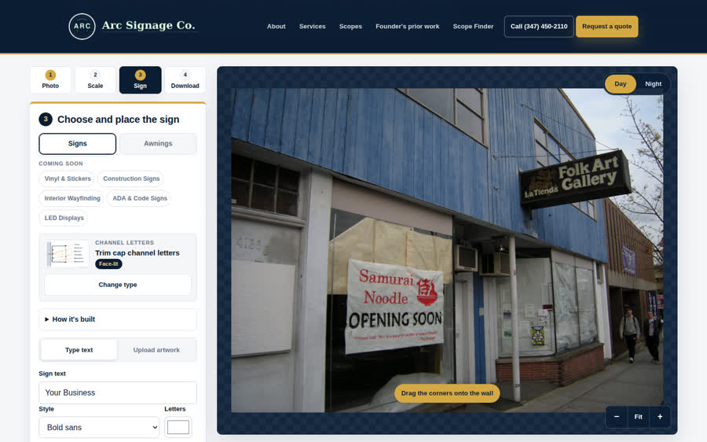 | 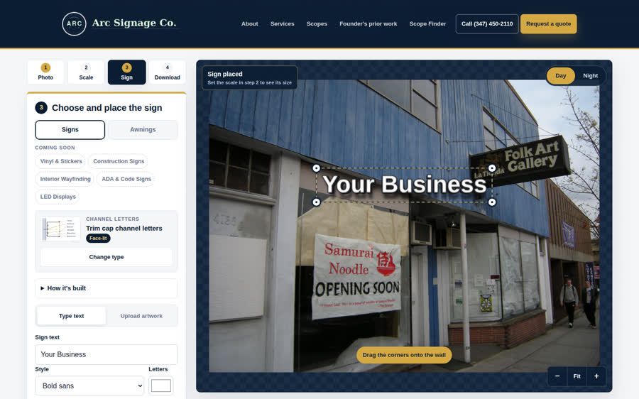 |

### 2. Emoji print as "?" in the PDF (Medium, fixed)

**Steps:** in step 4, type a project name or notes with an emoji (for example "Old Town Grocery 🍎"), then download the PDF. The same happens with emoji in proof comments.

**Before:** "Old Town Grocery ? (QA test)", and "?" throughout the notes.

**Fix:** the PDF writer drops emoji and the extra space they leave. ™ © ® and accented letters are kept. A unit check was added to `npm test`. Commit `9c97f69`.

| Before | After |
|---|---|
| 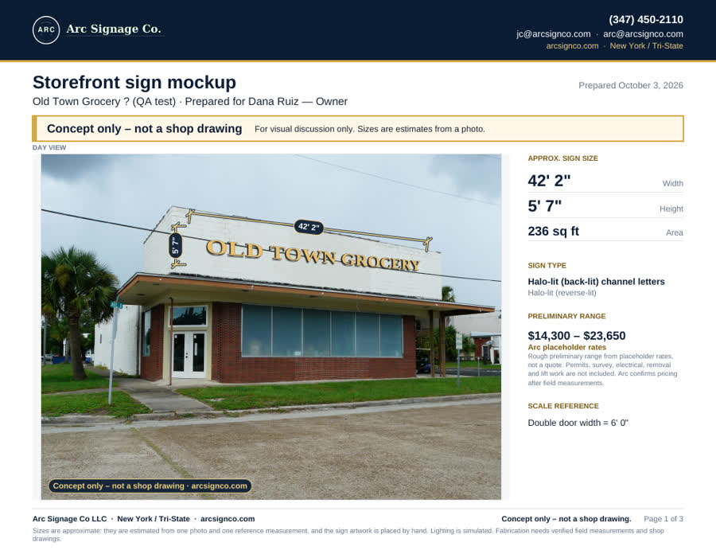 | 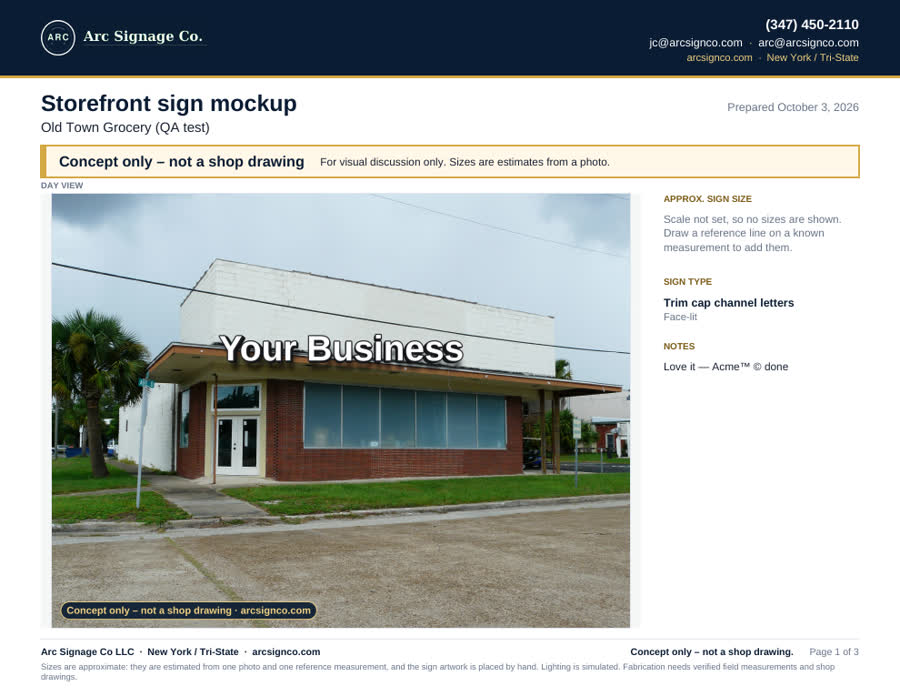 |

### 3. "Match artwork" checkbox has no label (Medium: axe "critical", fixed)

**Steps:**

1. Step 3, Trim cap channel letters (or any type with an "auto" option).
2. A screen reader announces the checkbox under "Returns" with no name.
3. Clicking the words "Match artwork" did nothing.

**Fix:** the text is now the checkbox's `<label>`, so it is announced and clickable. Commit `0c7b513`.

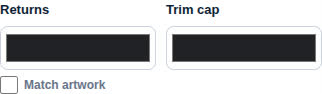

### 4. "Non-lit" badge contrast 4.1:1 (Low: axe "serious", fixed)

**Steps:** step 3, Awnings, Traditional slope (or any non-lit sign type).

**Before:** grey `#657287` 11 px text on `#e6eaf0`, below the 4.5:1 minimum.

**Fix:** darker text `#4a5568` (about 6.3:1). Commit `0c7b513`.

| Before | After |
|---|---|
| 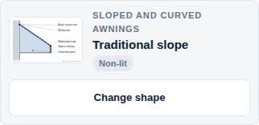 | 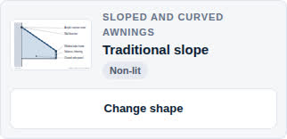 |

### 5. Proof page footer link only distinguishable by colour (Low: axe "serious", fixed)

**Steps:** open any approval link on a phone and look at "arcsignco.com" in the footer line.

**Fix:** the link is underlined. Commit `0c7b513`.

| Before | After |
|---|---|
| 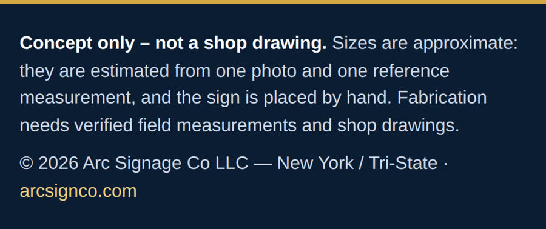 | 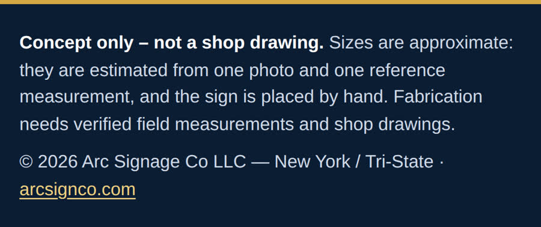 |

### 6. Tiny width collapses the sign; Reset corners can't recover it (Low, fixed)

**Steps:**

1. Set the scale.
2. In step 3, "Resize to a width": 0 ft 0.1 in, then Apply.
3. Press "Reset corners".

**Before:** the sign shrank to a single dot ("0" W × 0" H"). Reset kept that size, so the client had to start over.

**Fix:**
- Widths and drops under 1 inch are refused with a message.
- Reset corners falls back to the default size when the sign is smaller than 4% of the photo width.

Commit `e63352b`.

| Before | After |
|---|---|
| 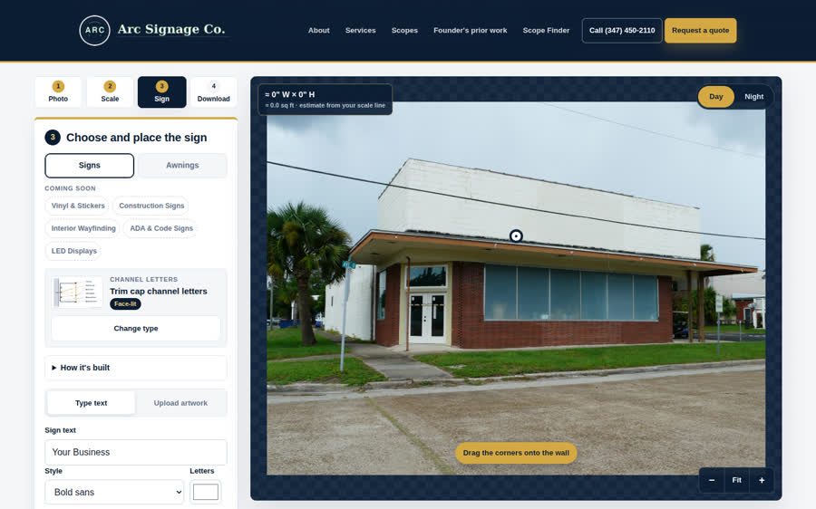 | 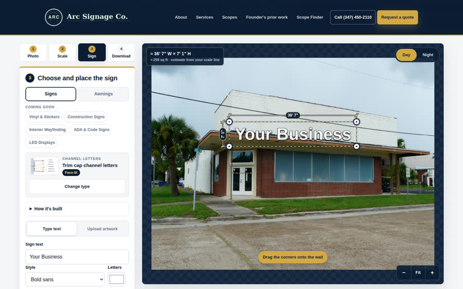 |

## Open items, not fixed

These were left alone because they're judgment calls rather than clear bugs.

| # | Severity | Item | Suggestion |
|---|---|---|---|
| A | Medium | **Non-Latin text prints as "?" in the PDF.** Chinese, Arabic, Cyrillic, Hebrew and similar text in the project name, prepared-for, notes or comments is affected. The PDF uses the built-in Helvetica font, which only covers Western European characters. The sign artwork itself is an image and renders any script correctly. | Embed a Unicode font subset in the PDF (adds file size), or render those fields as images. Decide based on how many clients use non-Latin names. |
| B | Low | **Calibration accepts implausible lengths** (999 ft, or 1e9 typed as a number) with no warning. Sizes and prices become absurd. | Warn when the reference line is over 100 ft or under 2 in. |
| C | Low | **All-white artwork becomes an invisible sign.** Background removal leaves nothing and no message is shown. | Show "No artwork left after removing the background". |
| D | Low | **Very small photos** (e.g. 64 × 40 px) are accepted and shown blurred at about 14× zoom, with no warning. | Warn under about 800 px wide. |
| E | Info | **Emoji in the sign text** draw in their own colours, not the chosen letter colour. This is normal browser text rendering. | None needed. |
| F | Info | **The brief mentions 18 sign types; the library has 17.** The old 18th type ("awning") became the Awnings tab with 29 shapes. Old links with that id open as the Traditional slope. | None. |

## What still needs a human

- **Realism.** Judge the renders on real client photos. Contact sheets of all types are below and in the artifacts:
  - lighting strength at night (halo wash, light-box glow, gooseneck pools)
  - letter depth and shadows
  - awning shapes and stripe scale
  - whether sizes "feel right" for a typical storefront

  Lighting is simulated, not photometric.
- **Pricing.** Every range uses **Arc placeholder rates** in `tools/sign-mockup/js/categories/<id>.js`, including the awning per-foot rates and the backlit adder. Replace them with real rates, and bump `RATES_VERSION` in `js/pricing-config.js`, before any client sees a number.
- **Real iPhone (and Android).** This QA used an emulated phone. On a device, check:
  - picking from Photos and taking a new photo
  - Safari's native HEIC decode
  - memory with a 48 MP photo
  - WebGL rendering
  - dragging handles with a finger
  - downloading and sharing the PDF (iOS opens it in a viewer or share sheet)
  - opening an approval link from iMessage/SMS, then commenting and approving
  - the phone and email links
- **Screen reader.** Automated axe scans are clean. A short VoiceOver pass on the editor and proof page is still worth doing.
- **Netlify settings.** Add a form notification for `sign-proof-activity` if Jesus wants emails on approvals and comments.
- **Clean up preview test data.** QA created test proofs under `v1/deploy-preview/` in the `arc-sign-mockup-proofs` Blobs store. They never show on production; delete by prefix if wanted (see `docs/sign-mockup-approval-links.md`).
- **Legal.** The NYC awning lettering note is a summary to verify, not legal advice.

## Screenshots

All saved under `/opt/cursor/artifacts/qa/` on the QA machine:

| Folder | Contents |
|---|---|
| `flow/` | Full client journey: `d*` desktop editor, PDF pages and coming-soon tabs; `p*` phone proof page, approval and approved PDF; `m*` phone editor with an awning and its PDF |
| `types/` | Every sign type and awning shape, day and night, plus PDF pages for a few types |
| `photos/` | Every uploaded photo day and night, artwork uploads and odd text |
| `bugs/` | Before/after for each bug |
| `contact-*.png` | Contact sheets |

All 17 sign types at night (non-lit types stay dark by design):

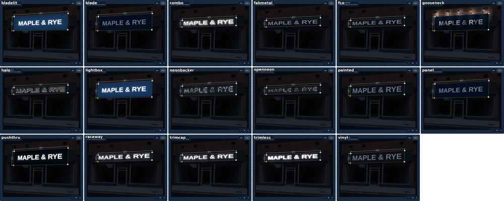

All 29 awning shapes by day (test placement on the sign band, not a design suggestion):

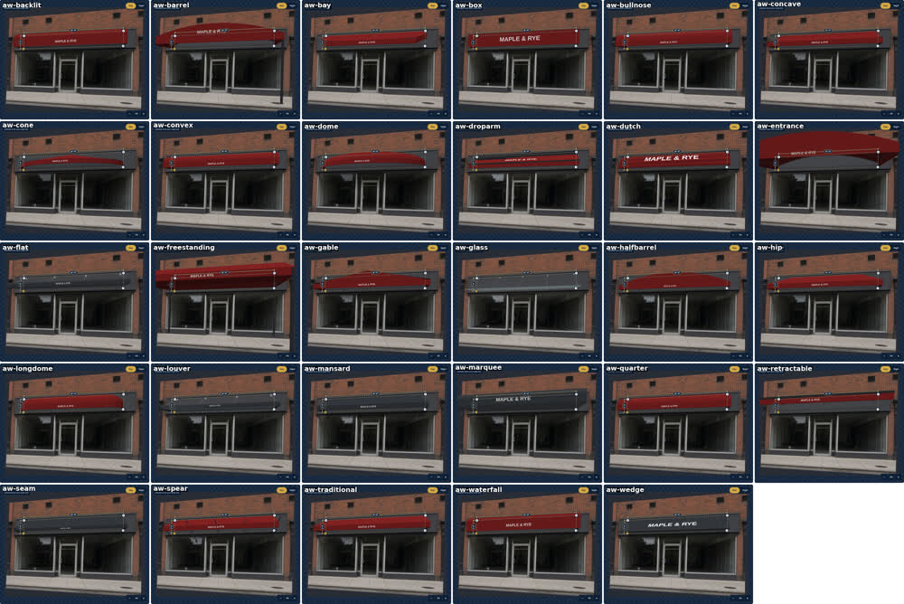

## Test photos

Real storefront photos from Wikimedia Commons (CC BY / CC BY-SA), used only as local test inputs and not added to the site or repo. They were converted to HEIC, PNG and WebP, upscaled to 48 MP, rotated with an EXIF orientation tag, cropped to a 16000 px panorama and shrunk to 64 × 40 px. An empty file and a text file named `.jpg` were also tried.

## How this was run

- **Scripts:** the QA scripts drive Chrome against the preview. They are kept outside the repo because the project has no browser-test dependency.
  - `qa-static.mjs`: speed, links, axe, vendor scan, private paths
  - `qa-photos.mjs`: uploads and odd input
  - `qa-types.mjs`: every type, option and PDF
  - `qa-flow.mjs`: the client journey and the phone proof page
  - `qa-verify-fixes.mjs`: re-checks each fix
- **Regression:** the existing sign, awning and category suites were re-run on the final preview.
- **Unit checks:** `npm test` (22 unit tests + 230 checks) passes.
