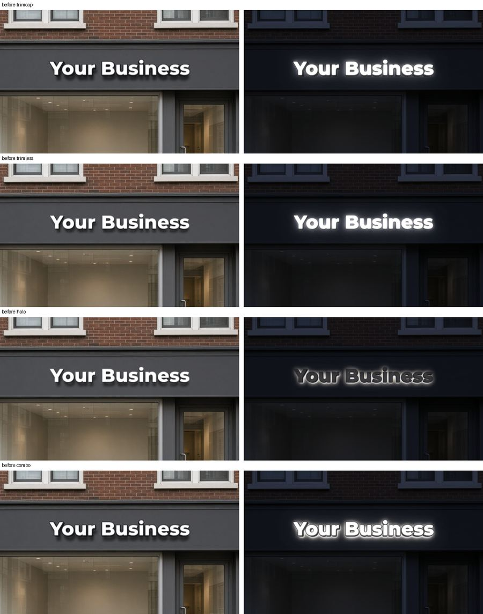
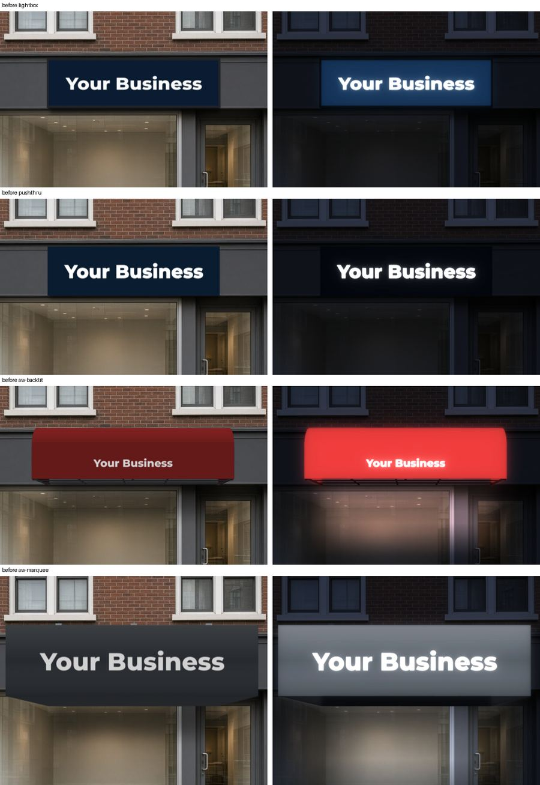
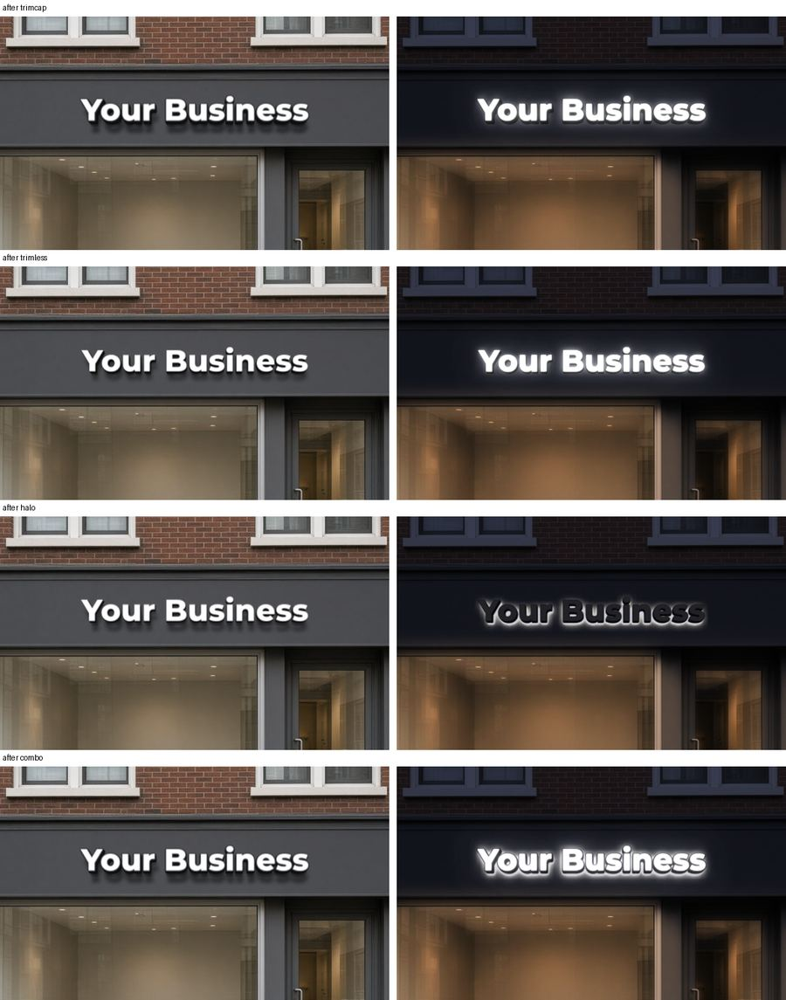
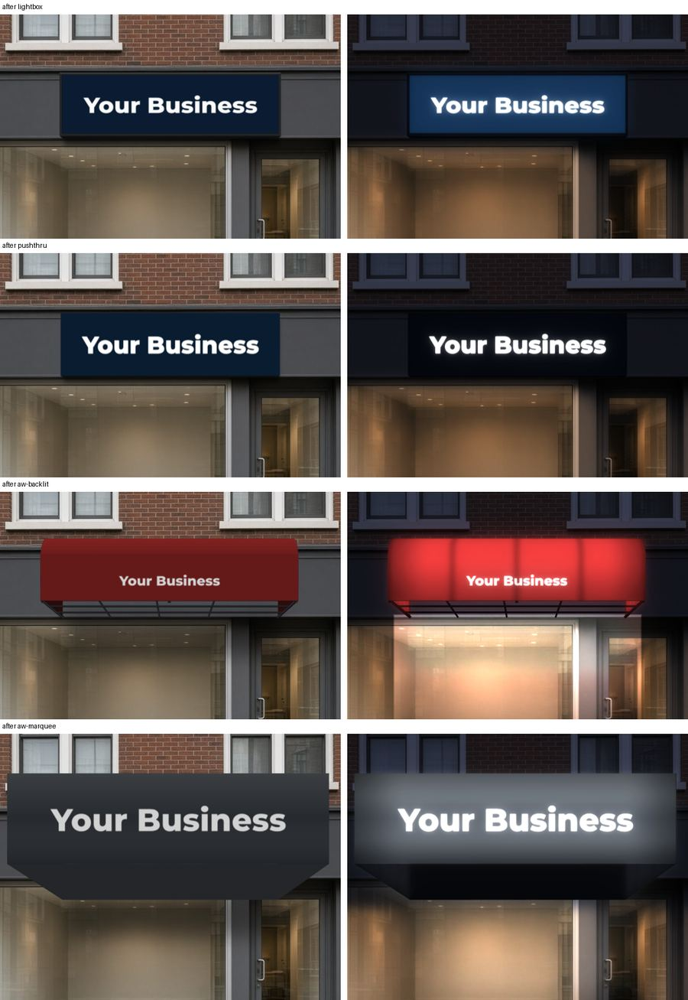
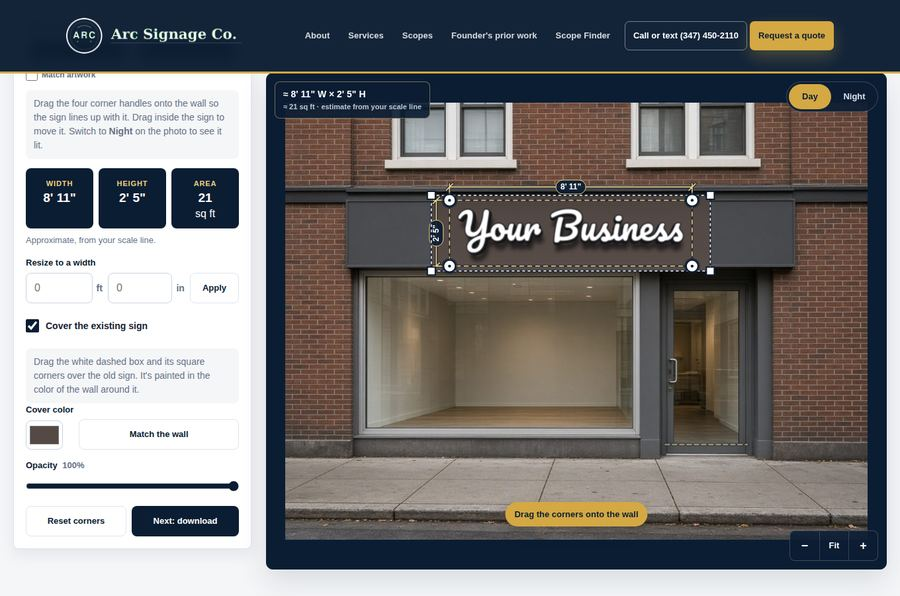
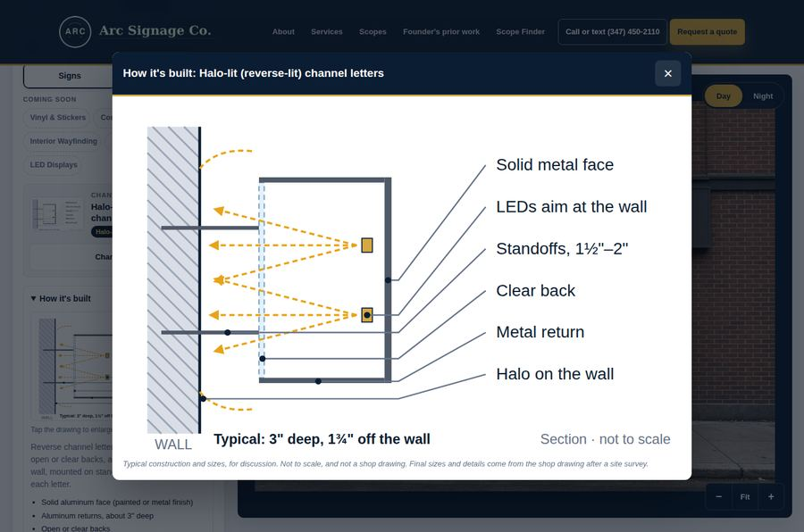
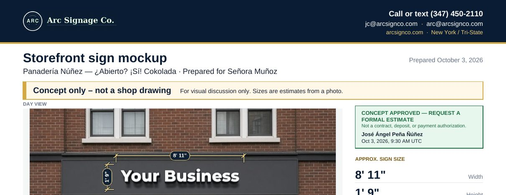
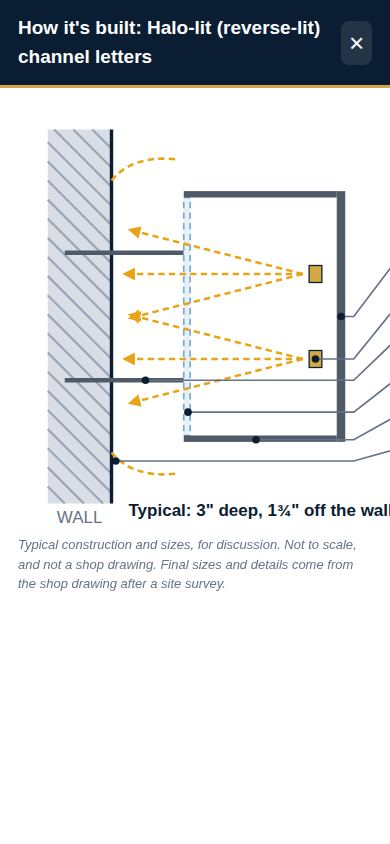

# Sign mockup tool: pre-go-live QA report

- **What:** `/tools/sign-mockup/` and its phone approval page, on Deploy Preview 13 (PR #13, **not merged**).
- **Preview:** https://deploy-preview-13--arcsign.netlify.app/tools/sign-mockup/
- **Rounds:**
  - **Round 2, team-review fixes:** Oct 3, 2026, 08:15–09:40 UTC. Final build `2103463`.
  - **Round 1, pre-go-live QA:** Oct 3, 2026, 07:05–07:35 UTC. Build `9c97f69`. Its bugs are written up under "Round 1 bugs" below.
- **Browser:** Chrome 14x through Playwright, software WebGL.
  - Desktop: 1440 × 900.
  - Phone: 390 × 844, iPhone Safari user agent, touch input, 3× pixel ratio.
- **Not covered:** a real iPhone or Android device. See "What still needs a human".

## Summary

Every fix in the team review is in and re-tested on the preview, on desktop and phone. All suites pass on the final build: **571 browser checks and `npm test`, 0 failures.**

This round found **1 new issue**, now fixed:

- **(Low a11y, fixed)** On a phone, the enlarged construction drawing scrolls sideways, but keyboard users couldn't reach that scroll area (axe "serious"). It is now focusable and labelled "Construction drawing". Commit `2103463`.

Round 1's open items A–D are **resolved** (see "Round 1 open items, now resolved").

**What changed for the client in this round:**

- **No dollar amounts** while rates are placeholders. The tool, the PDF, the approval page and the server all say "A price is prepared after a site survey". There is one full disclaimer, and the approval stamp reads "CONCEPT APPROVED — REQUEST A FORMAL ESTIMATE".
- **English and Spanish in the PDF.** Accents, ñ, ü, ¿ and ¡ (capitals too) print correctly, in the body text and on the approval stamp. Other scripts and emoji are dropped cleanly.
- **Warnings:**
  - an unusual scale length
  - artwork that disappears when its background is removed
  - photos under 800 px wide
- **More realistic renders:**
  - street-level eye line
  - darker returns and contact shadows
  - halo glow without a lit face
  - softer night with lit shop windows
  - light-box retainer
  - backlit awning falloff with rafters
- **New:**
  - an original sample storefront photo with a blank sign band
  - a "Cover the existing sign" patch
  - six self-hosted sign typefaces
  - click-to-enlarge construction drawings with typical sizes
  - a solid navy stage, a drag hint that fades, and a size chip that moves off the sign

## Pass/fail by suite

All runs are against the preview. The last four suites ran on `2103463`.

qa-photos, qa-flow and qa-types ran on `8fc4834`. The only change after that build is one HTML attribute on the drawing dialog. qa-v3, which covers that dialog, re-ran on `2103463`.

| Suite | What it covers | Desktop + phone | Result |
|---|---|---|---|
| `qa-v3` (new) | Sample photo, drag hint, 6 fonts, size chip, cover patch, construction drawings, withheld price, the three warnings, Spanish PDF and Spanish approval stamp, axe on the new controls | both | **58 / 58** |
| `qa-types` | 17 sign types + 29 awning shapes, every option value, day/night, price text, a PDF per type, odd input | desktop | **192 / 192** |
| `qa-photos` | HEIC, 20 MP HEIC, 48 MP JPG, PNG, WebP, EXIF-rotated, 16000 px panorama, 64 × 40 px, empty, fake; artwork uploads | both | **85 / 85** |
| `qa-flow` | Full client journey: editor, PDF, approval link, phone proof page, comment, approve, approved PDF; phone awning flow | both | **55 / 55** |
| `qa-static` | Load speed, links, axe, keyboard, vendor names, private paths | both | **25 / 25** |
| Sign flow regression (`e2e2`) | | both | **56 / 56** |
| Awning flow regression (`e2e-aw`) | | both | **46 / 46** |
| Category tabs regression (`cats`) | | both | **54 / 54** |
| `npm test` | Unit tests and checks, including pricing, WinAnsi text and proof API | — | **Pass** (283 checks) |

### Checks updated for intended changes

Some round 1 assertions tested old behaviour that the team asked to change. They were updated, not skipped:

| Old expectation | New expectation |
|---|---|
| A "$x – $y" range on every type | No "$" anywhere while `PLACEHOLDER` is true, plus "A price is prepared after a site survey" |
| PDF says "Arc placeholder rates" | PDF says "price is prepared after a site survey" and prints the full disclaimer |
| Stamp says "APPROVED FOR NEXT STEPS" | "CONCEPT APPROVED — REQUEST A FORMAL ESTIMATE" plus "Not a contract, deposit, or payment authorization." |
| "Halo-lit (back-lit)" | "Halo-lit (reverse-lit)" |
| HEIC photo label "HEIC" | "iPhone photo converted" |
| All-white artwork loads silently | Refused with "No artwork left after removing the background…"; the current sign is kept |

### Highlights

- **Spanish:** "Panadería Núñez — ¿Abierto? ¡Sí!", "Señora Muñoz" and "pingüino" print exactly in the editor PDF. "José Ángel Peña Ñúñez" prints exactly on the approved PDF's stamp.
  - Č folds to C.
  - 寿司, Привет, مرحبا and 🍞 are dropped, with no stray "?".
  - The PDFs stay about 0.5 MB, almost all of it photos. No font is embedded, because built-in Helvetica with WinAnsi encoding covers every Spanish character.
- **Withheld prices:** checked on all 46 types and shapes, the editor PDF, the phone awning PDF, the proof page and the approved PDF.
- **Warnings:**
  - A 64 × 40 photo shows a "small" warning; a normal photo shows none.
  - A 999 ft or 0.5 in scale line warns; 3 ft and 20 ft don't.
  - All-white artwork is refused, and a normal logo still loads.
- **Cover patch:** samples the wall colour, paints into the download image, and is removed when unticked.
- **Accessibility:** 0 serious or critical axe issues on these screens:
  - the empty editor and the type library (desktop and phone)
  - step 3 with a sign placed and with the cover tools open
  - the construction drawing dialog (after the fix)
  - step 4
  - the phone proof page

  Closing the drawing dialog returns focus to the drawing. All 39 tab stops show a focus ring.
- **Vendor names:** none in 49 served files or any generated PDF (56 name patterns). Images and fonts are scanned for readable text only.
- **Console errors:** none on any page, type, shape or flow.

### Load speed

Measurements use a cold cache.

| Page | First paint | Tool ready | Transfer | Requests | Layout shift | Round 1 transfer |
|---|---|---|---|---|---|---|
| Editor, desktop | 0.83 s | 0.41 s | 233 KB | 43 | 0.000 | 122 KB / 36 |
| Editor, phone, Fast 4G + 4× CPU | 0.38 s | 1.02 s | 239 KB | 43 | 0.000 | 127 KB / 36 |
| Proof page, phone, Fast 4G + 4× CPU | 0.32 s | 0.85 s | 108 KB | 34 | 0.000 | 100 KB / 34 |

The editor's extra ~110 KB is the six sign typefaces:

- They are Latin-1 WOFF2 subsets, 11–29 KB each.
- They load after first paint, so they don't hold up the page.
- They are cached for a year (`netlify.toml`, versioned file names).

Photo processing is unchanged from round 1:

- 48 MP JPG: 0.5 s
- 12 MP HEIC: 1.5 s
- 20 MP HEIC: 3.5 s

## Render realism, before and after

Same placement and options in every pair; day on the left, night on the right.

| Letters (trim cap, trimless, halo, combo) | Cabinets and awnings (light box, push-through, backlit awning, marquee) |
|---|---|
|  |  |
|  |  |

What changed:

- The camera sits at street level.
- Returns are darker and trim caps have a lit edge.
- Signs cast a soft shadow plus a contact shadow.
- Halo letters light the wall, not their own face.
- Night is less crushed, and shop windows below the sign glow warm.
- The light box shows its retainer.
- The backlit awning falls off toward the edges, with rafter bands and a wash down the storefront.
- The marquee fascia gets no rafters.

## New features

| Sample photo, cover patch, script typeface, solid navy stage | Construction drawing, enlarged |
|---|---|
|  |  |

| Spanish approved PDF (stamp) | Drawing on a phone (scrolls sideways) |
|---|---|
|  |  |

- **Sample photo:** `img/sample-storefront.jpg` is original, AI-generated, metadata stripped, about 155 KB. It loads with a 3 ft door scale line already set, and the sign starts on its blank band.
- **Cover the existing sign:** a dashed patch with corner handles, painted in the sampled wall colour (or any colour). It is included in the image, the PDF and the approval link.
- **Typefaces:** Montserrat, Archivo, Oswald, Anton, Source Serif and Pacifico. All are SIL Open Font License, self-hosted, and the license is in `fonts/LICENSE.txt`. Text signs no longer have a CSS drop shadow.

## Round 1 open items, now resolved

| # | Item | Now |
|---|---|---|
| A | Non-Latin text printed as "?" in the PDF | **Resolved per Jesus: English and Spanish only.** Built-in Helvetica with WinAnsi covers all Spanish letters. Other Latin letters fold (č → c), and other scripts and emoji are dropped cleanly. No large font is embedded. |
| B | Implausible calibration lengths accepted silently | **Resolved.** Lines under 2 in or over 100 ft show "Scale set to X, which is unusual for a storefront. Check the feet and inches." |
| C | All-white artwork became an invisible sign | **Resolved.** Refused with "No artwork left after removing the background. Try a file with darker artwork, or one with a clear background." The current sign is kept. |
| D | Very small photos accepted without a warning | **Resolved.** Photos under 800 px wide show a warning under the photo. |
| E | Emoji in the sign text draw in their own colours | Unchanged; normal browser behaviour. |
| F | Brief says 18 sign types; library has 17 | Unchanged; the 18th became the Awnings tab. |

## Round 1 bugs (all fixed in round 1, still passing)

| # | Severity | Bug | Commit |
|---|---|---|---|
| 1 | High | New photo after a sign was placed: the sign disappeared while Download stayed enabled | `371d94a` |
| 2 | Medium | Emoji printed as "?" in the PDF | `9c97f69` |
| 3 | Medium (axe critical) | "Match artwork" checkbox had no label | `0c7b513` |
| 4 | Low (axe serious) | "Non-lit" badge contrast 4.1:1 | `0c7b513` |
| 5 | Low (axe serious) | Proof footer link distinguished by colour only | `0c7b513` |
| 6 | Low | A tiny width collapsed the sign, and Reset corners couldn't recover it | `e63352b` |

| Bug | Before | After |
|---|---|---|
| 1 |  |  |
| 2 |  |  |
| 3 |  | The text is now the checkbox's label |
| 4 |  |  |
| 5 |  |  |
| 6 |  |  |

## What still needs a human

- **Real rates.** All numbers live in `tools/sign-mockup/js/pricing-config.js`. While `PLACEHOLDER = true`, no dollar amount is shown anywhere. To go live with prices:
  1. Enter Arc's rates.
  2. Bump `RATES_VERSION`.
  3. Set `PLACEHOLDER = false`.

  The tool then shows "Preliminary estimate" ranges.
- **Realism.** Judge the renders on real client photos, especially:
  - night lighting strength
  - the lit-window effect on very bright or very dark interiors
  - awning stripe scale

  Lighting is simulated, not photometric.
- **Real iPhone (and Android).** On a device, check:
  - picking from Photos and taking a new photo
  - Safari's native HEIC decode
  - memory with a 48 MP photo
  - WebGL rendering
  - dragging handles and the cover patch with a finger
  - downloading and sharing the PDF
  - opening an approval link from iMessage/SMS, then commenting and approving
  - the phone and email links
- **Screen reader.** Automated axe scans are clean. A short VoiceOver pass on the editor and proof page is still worth doing.
- **Netlify settings.** Add a form notification for `sign-proof-activity` if Jesus wants emails on approvals and comments.
- **Clean up preview test data.** QA created test proofs under `v1/deploy-preview/` in the `arc-sign-mockup-proofs` Blobs store. They never show on production (see `docs/sign-mockup-approval-links.md`).
- **Legal.** The NYC sign and awning notes are summaries to verify, not legal advice.

## Screenshots

On the QA machine:

| Folder | Contents |
|---|---|
| `/opt/cursor/artifacts/qa3/v3/` | Round 2 checks, desktop and phone: sample photo, cover patch, card zoom, warnings, Spanish PDFs and the approved Spanish PDF |
| `/opt/cursor/artifacts/qa3/flow/`, `types/`, `photos/` | Round 2 re-runs of the client journey, every type and shape day and night, and every upload |
| `/opt/cursor/artifacts/render/` | Before/after renders per type, day and night, plus the four contact sheets above |
| `/opt/cursor/artifacts/screenshots/` | `v3-*` editor screenshots, desktop and phone |
| `/opt/cursor/artifacts/qa/` | Round 1 screenshots and bug before/after |

## Test photos

Round 1 used real storefront photos from Wikimedia Commons (CC BY / CC BY-SA) as local test inputs only. They are not on the site or in the repo.

They were converted to HEIC, PNG and WebP, upscaled to 48 MP, rotated with an EXIF tag, cropped to a 16000 px panorama and shrunk to 64 × 40 px. An empty file and a text file named `.jpg` were also tried. Round 2 also uses the tool's own sample photo.

## How this was run

- **Scripts:** the QA scripts drive Chrome against the preview. They are kept outside the repo because the project has no browser-test dependency.
  - `qa-v3.mjs`: round 2 fixes and new features
  - `qa-static.mjs`: speed, links, axe, vendor scan, private paths
  - `qa-photos.mjs`: uploads and odd input
  - `qa-types.mjs`: every type, option and PDF
  - `qa-flow.mjs`: the client journey and the phone proof page
- **Regression:** the existing sign, awning and category suites were re-run on the final preview.
- **Unit checks:** `npm test` passes.
